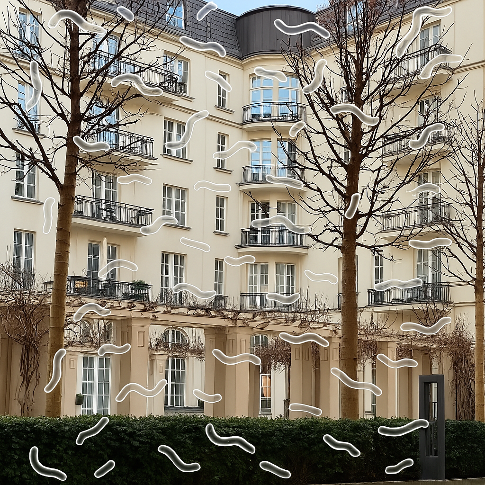

# Symptome
{: .no_toc }

## Inhaltsverzeichnis
{: .no_toc .text-delta }

1. TOC
{:toc}

---

Eine Netzhautablösung äußert sich durch verschiedene Sehstörungen, darunter Lichtblitze, vermehrte Schlieren (Mouches volantes), schwarze Punkte, Schatten im Sichtfeld oder ein teilweiser bis vollständiger Sehverlust auf einem Auge.

Bei diesen Anzeichen ist es entscheidend, **sofort** eine Augenärztin oder einen Augenarzt aufzusuchen, da eine Netzhautablösung ein medizinischer Notfall ist. Ohne rasche Behandlung kann sich die Netzhaut weiter ablösen, was im schlimmsten Fall zur Erblindung des betroffenen Auges führt.

Da eine Netzhautablösung schmerzlos verläuft, wird sie von Betroffenen häufig unterschätzt. Dies kann dazu führen, dass ärztliche Hilfe zu spät in Anspruch genommen wird.

## Lichtblitze

Blitze oder bogenförmige Lichterscheinungen im Auge, insbesondere in der Dämmerung oder bei plötzlichen Bewegungen des Kopfes, können auf eine beginnende Netzhautablösung hindeuten. Diese Lichtphänomene entstehen, wenn der Glaskörper an der Netzhaut zieht und dort mechanische Reize auslöst. Die Blitze im Auge können auch wahrgenommen werden, wenn die Augen geschlossen sind. Dies liegt daran, dass diese Lichter nicht durch äußeres Licht verursacht werden, sondern durch mechanische Reize auf die Netzhaut.

<!--  -->

## Glaskörpertrübungen

Mouches volantes (engl. floaters) sind mehr oder weniger wahrnehmbare Punkte, Flecken oder fadenartige Strukturen im Gesichtsfeld. Manche Betroffene beschreiben sie auch als "fliegende Mücken". Sie entstehen meist durch Trübungen des Glaskörpers, die Schatten auf die Netzhaut werfen. Diese Schatten erscheinen als kurze oder lange Fäden, Schlieren oder punktförmige Gebilde, die durch das Sichtfeld schweben.

Bis zu einem gewissen Grad sind Mouches volantes harmlos, da sie selbst in jungen, gesunden Augen auftreten können. Ein plötzlicher Anstieg ihrer Anzahl kann jedoch darauf hindeuten, dass sich der Glaskörper ablöst. In einigen Fällen kann dies zu einer Zugbelastung auf die Netzhaut führen, was wiederum eine traktive Ablatio (zugbedingte Netzhautablösung) verursachen kann.

**Beispiel:**

