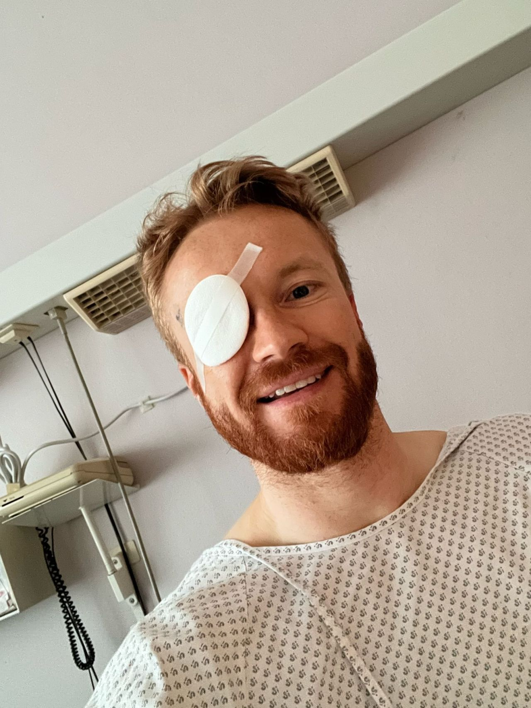

# Augenalarm
{: .fs-9 }

Augenalarm bietet Informationen zu Netzhauterkrankungen sowie zu Operationen bei Netzhautlöchern und Netzhautablösungen – aus der Perspektive eines Betroffenen.
{: .fs-6 .fw-300 }

## Vorwort

Liebe Besucherinnen und Besucher, herzlich willkommen auf **Augenalarm.de** – einem Ratgeber für Betroffene von Netzhautablösungen.

Mein Name ist Benny Neugebauer, und am 27. Februar 2024 wurde bei mir eine Netzhautablösung (_Ablatio retinae_) am rechten Auge diagnostiziert. Diese Nachricht war ein Schock. Innerhalb kürzester Zeit musste ich notoperiert werden, da ohne Eingriff die Gefahr einer Erblindung bestand. Ich fühlte mich überwältigt, hilflos und voller Angst vor dem, was kommen würde.

Doch es gibt auch eine gute Nachricht: Nach 224 Tagen habe ich meine volle Sehkraft (mit Kontaktlinsen) zurückerlangt. Diese Erfahrung hat mich viel gelehrt, und ich möchte meine Geschichte hier teilen – nicht nur, um Wissen zu vermitteln, sondern auch, um anderen Betroffenen Mut zu machen. Wenn du dich gerade in einer ähnlichen Situation befindest, soll diese Seite dir helfen, dich nicht so verloren zu fühlen, wie ich es damals tat.

## Foto

Das war ich am 28. Februar nach meiner ersten Cerclage-OP im Virchow-Klinikum Berlin. Damals ahnte ich noch nicht, dass ich nur eine Woche später erneut eine Pars-plana-Vitrektomie benötigen würde. Ich wusste auch nicht, dass ich bereits am 29. September 2024 den Berlin Marathon erfolgreich laufen würde. Es gibt also immer einen Funken Hoffnung! 

